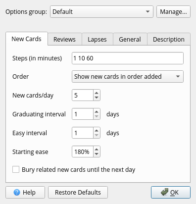
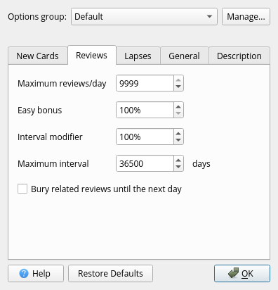
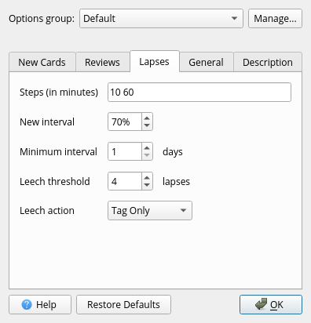
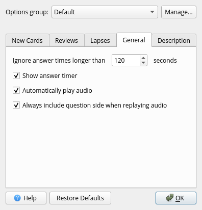

# Settings
These are my Anki settings which are heavily based on the information found on the websites linked in the [Sources](#sources) section. I advise everyone who is seriously interested in maximizing their Anki gains to check out the additional information linked at the bottom instead of just blindly copying my settings. I also encourage everyone to be playful about their settings and to try out different things until it feels right and a retention rate of 80% - 90% is reached.

!!! quote "[Eliezer Yudkowsky](https://www.lesswrong.com/posts/fg9fXrHpeaDD6pEPL/truly-part-of-you)"
    A shepherd builds a counting system that works by throwing a pebble into a bucket whenever a sheep leaves the fold, and taking a pebble out whenever a sheep returns. If you, the apprentice, do not understand this system—if it is magic that works for no apparent reason—then you will not know what to do if you accidentally drop an extra pebble into the bucket. That which you cannot make yourself, you cannot remake when the situation calls for it. You cannot go back to the source, tweak one of the parameter settings, and regenerate the output, without the source.

=== "New Cards"
    

=== "Reviews"
    

=== "Lapses"
    

=== "General"
    

## Sources
* [Anki Manual](https://docs.ankiweb.net/)
* [Low-Key Anki](https://massimmersionapproach.com/table-of-contents/anki/)
* [**Video:** Anki Tutorial | Deck Options and Anki's Algorithm](https://www.youtube.com/watch?v=lz60qTP2Gx0)
* [**Video:** Guide to Anki Intervals and Learning Steps](https://www.youtube.com/watch?v=1XaJjbCSXT0)
* [What Anki Learning Steps To Use](https://eshapard.github.io/anki/what-anki-learning-steps-to-use.html)
* [Target An 80-90 Percent Success Rate In Anki](https://eshapard.github.io/anki/target-an-80-90-percent-success-rate-in-anki.html)
* [Anki's Starting Ease Factor Setting](https://eshapard.github.io/anki/ankis-initial-ease-factor-setting.html)
